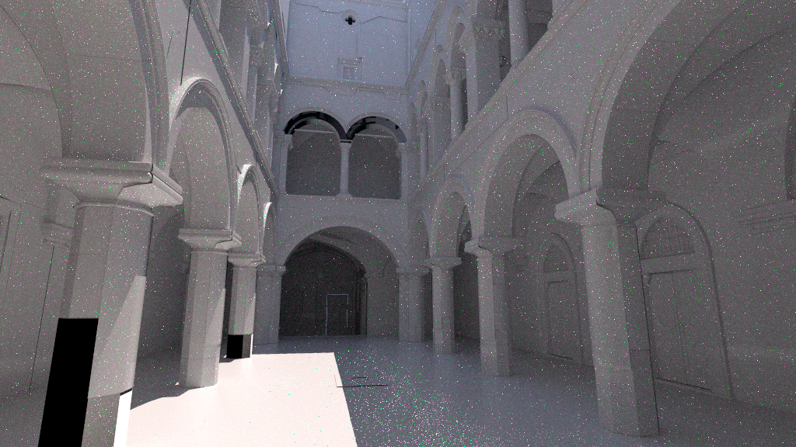
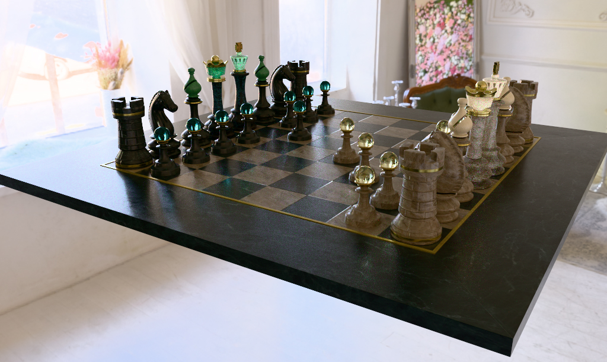
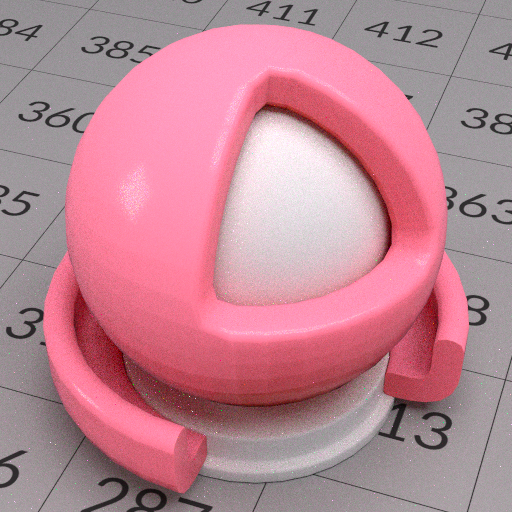
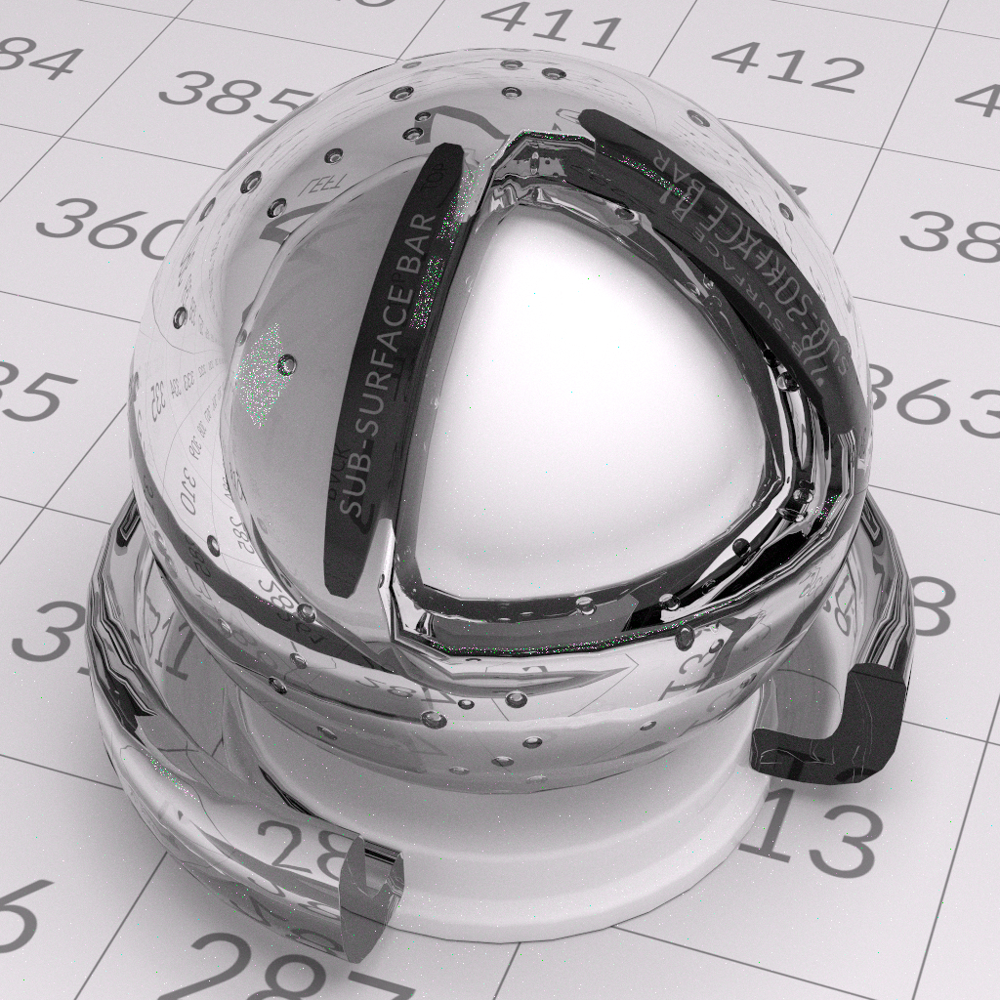
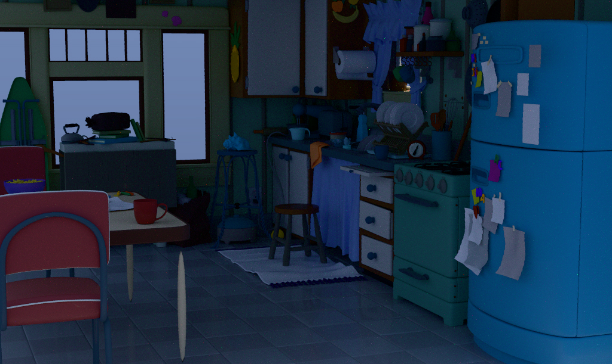
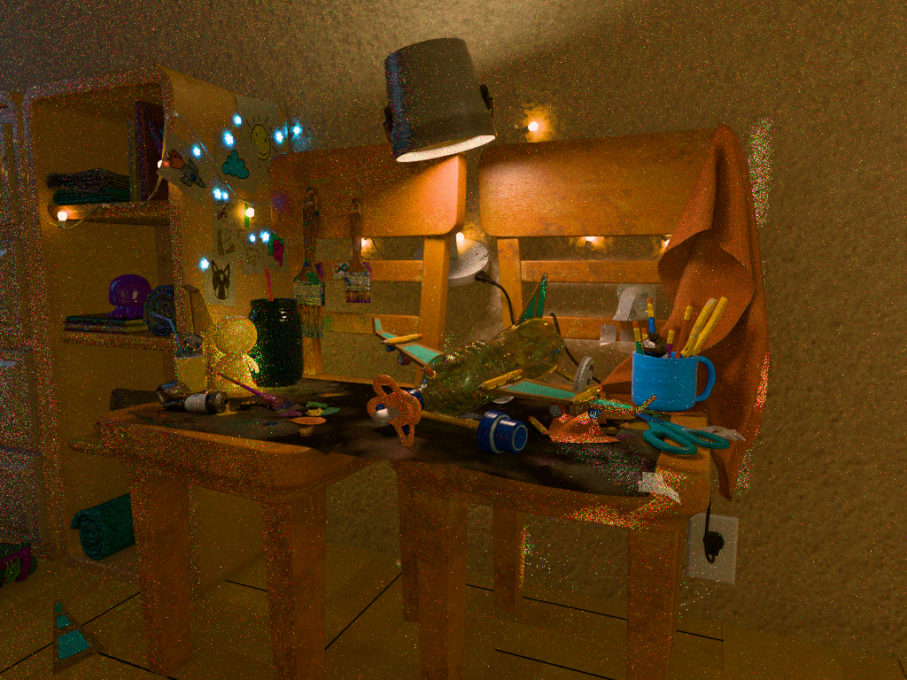
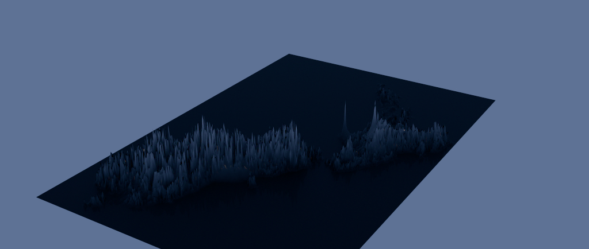

## Gallery

These images are versioned visual baselines, not golden-reference renders.
The checked-in baselines are 1024 pixels wide and use 1024 spatial samples to
reduce residual path-tracing noise. They render in 32 progressive updates with
subdivision and MaterialX displacement enabled at the deterministic level-2
gallery setting. The New Zealand height-map scene is the deliberate exception:
its one authored quad is uniformly refined at level 8 before displacement.
`render_gallery.bat` preserves the renderer's scene-linear output as temporary
EXRs under `build/gallery-linear`, then writes these display JPEGs through a
neutral HDR highlight compressor and the standard sRGB transfer function. An
optional `HDCODEX_GALLERY_EXPOSURE` value sets display exposure in stops; the
versioned baselines use the default zero. Run the batch to reproduce the final
JPEGs; the per-scene commands below show the underlying render invocations.
The StandardShaderBall variants exercise OpenPBR glass, metal, subsurface, and
image-texture lowering. KitchenSet remains in its authored Z-up coordinates and
exercises the unbound-mesh `displayColor` fallback. CollectiveProject exercises
UsdSkel deformation and per-face material subsets. Image diffs should reveal
both intentional improvements and regressions as those paths evolve.

### Intel Sponza Base Scene
**Reference:** [Intel Graphics Research Samples](http://intel.com/content/www/us/en/developer/topic-technology/graphics-research/samples.html)

This asset's bound materials are USD-native `UsdPreviewSurface` networks. They
are intentionally reported as unsupported rather than translated into
MaterialX, so this baseline exercises the bound-material fallback and shader
provenance diagnostics.

**Command:**
```cmd
set "HDCODEX_SAMPLES_PER_PIXEL=1024"
set "HDCODEX_SAMPLES_PER_UPDATE=32"
.\render_codex.bat --imageWidth 1024 --colorCorrectionMode disabled --camera PhysCamera001 gallery\intel_sponza.usda build\gallery-linear\intel_sponza.exr
```



### OpenChessSet
**Reference:** [OpenChessSet Repository](https://github.com/usd-wg/assets/tree/main/full_assets/OpenChessSet)

**Command:**
```cmd
set "HDCODEX_SAMPLES_PER_PIXEL=1024"
set "HDCODEX_SAMPLES_PER_UPDATE=32"
.\render_codex.bat --imageWidth 1024 --colorCorrectionMode disabled --camera renderCam gallery\chess_board.usda build\gallery-linear\chess_board.exr
```



### StandardShaderBall BubbleGum
**Reference:** [StandardShaderBall Repository](https://github.com/usd-wg/assets/tree/main/full_assets/StandardShaderBall)

**Command:**
```cmd
set "HDCODEX_SAMPLES_PER_PIXEL=1024"
set "HDCODEX_SAMPLES_PER_UPDATE=32"
.\render_codex.bat --imageWidth 1024 --colorCorrectionMode disabled --camera camera gallery\shader_ball_bubblegum.usda build\gallery-linear\shader_ball_bubblegum.exr
```



### StandardShaderBall Glass
**Reference:** [StandardShaderBall Repository](https://github.com/usd-wg/assets/tree/main/full_assets/StandardShaderBall)

**Command:**
```cmd
set "HDCODEX_SAMPLES_PER_PIXEL=1024"
set "HDCODEX_SAMPLES_PER_UPDATE=32"
.\render_codex.bat --imageWidth 1024 --colorCorrectionMode disabled --camera camera gallery\shader_ball_glass.usda build\gallery-linear\shader_ball_glass.exr
```



### StandardShaderBall Gold
**Reference:** [StandardShaderBall Repository](https://github.com/usd-wg/assets/tree/main/full_assets/StandardShaderBall)

**Command:**
```cmd
set "HDCODEX_SAMPLES_PER_PIXEL=1024"
set "HDCODEX_SAMPLES_PER_UPDATE=32"
.\render_codex.bat --imageWidth 1024 --colorCorrectionMode disabled --camera camera gallery\shader_ball_gold.usda build\gallery-linear\shader_ball_gold.exr
```


### Pixar's KitchenSet
**Reference:** [Pixar's KitchenSet](https://openusd.org/release/dl_kitchen_set.html)

**Command:**
```cmd
set "HDCODEX_SAMPLES_PER_PIXEL=1024"
set "HDCODEX_SAMPLES_PER_UPDATE=32"
.\render_codex.bat --imageWidth 1024 --colorCorrectionMode disabled --camera renderCam gallery\pixar_kitchen.usda build\gallery-linear\pixar_kitchen.exr
```



### Collective Project 001
**Reference:** [Collective Project 001](https://github.com/usd-wg/collectiveproject001/blob/main/shots/s001_001/index.usda)

**Command:**
```cmd
set "HDCODEX_SAMPLES_PER_PIXEL=1024"
set "HDCODEX_SAMPLES_PER_UPDATE=32"
.\render_codex.bat --imageWidth 1024 --colorCorrectionMode disabled --purposes render --camera mono gallery\collectiveproject001.usda build\gallery-linear\collectiveproject001.exr
```


### OpenPBR Playground
**Reference:** [OpenPBR Playground](https://github.com/DigitalProductionExampleLibrary/OpenPBRShaderPlayground/blob/main/ShdrPlygrnd/ShdrPlygrnd_OpenPBR.usda)

This is the MaterialX/OpenPBR generation baseline. The authored `OJfoam`
material has a color3-to-float `geometry_opacity` interface mismatch and is
intentionally diagnosed and omitted.

**Command:**
```cmd
set "HDCODEX_SAMPLES_PER_PIXEL=1024"
set "HDCODEX_SAMPLES_PER_UPDATE=32"
.\render_codex.bat --imageWidth 1024 --colorCorrectionMode disabled --purposes render --camera renderCam_mainCU gallery\openpbr_playground.usda build\gallery-linear\openpbr_playground.exr
```



### New Zealand Height Map

This focused displacement baseline authors one bilinear quad and evaluates a
raw MaterialX `ND_image_float` height map after uniform level-8 refinement. The
same map drives the surface color so texture resolution and UV orientation are
visible independently of the displaced silhouette.

**Measured wall time (2026-09-01):** 691.620 seconds (11m 31.620s) at 1024
pixels wide, 1024 spatial samples, 32 samples per update, and subdivision level
8. This end-to-end render time includes renderer startup, scene loading,
MaterialX compilation, displacement refinement, and sampling; display-JPEG
conversion is excluded.

**Command:**
```cmd
set "HDCODEX_SAMPLES_PER_PIXEL=1024"
set "HDCODEX_SAMPLES_PER_UPDATE=32"
set "HDCODEX_ENABLE_SUBDIVISION=1"
set "HDCODEX_SUBDIVISION_LEVEL=8"
set "HDCODEX_ENABLE_DISPLACEMENT=1"
.\render_codex.bat --imageWidth 1024 --colorCorrectionMode disabled --camera camera gallery\newzealand_heightmap.usda build\gallery-linear\newzealand_heightmap.exr
```


